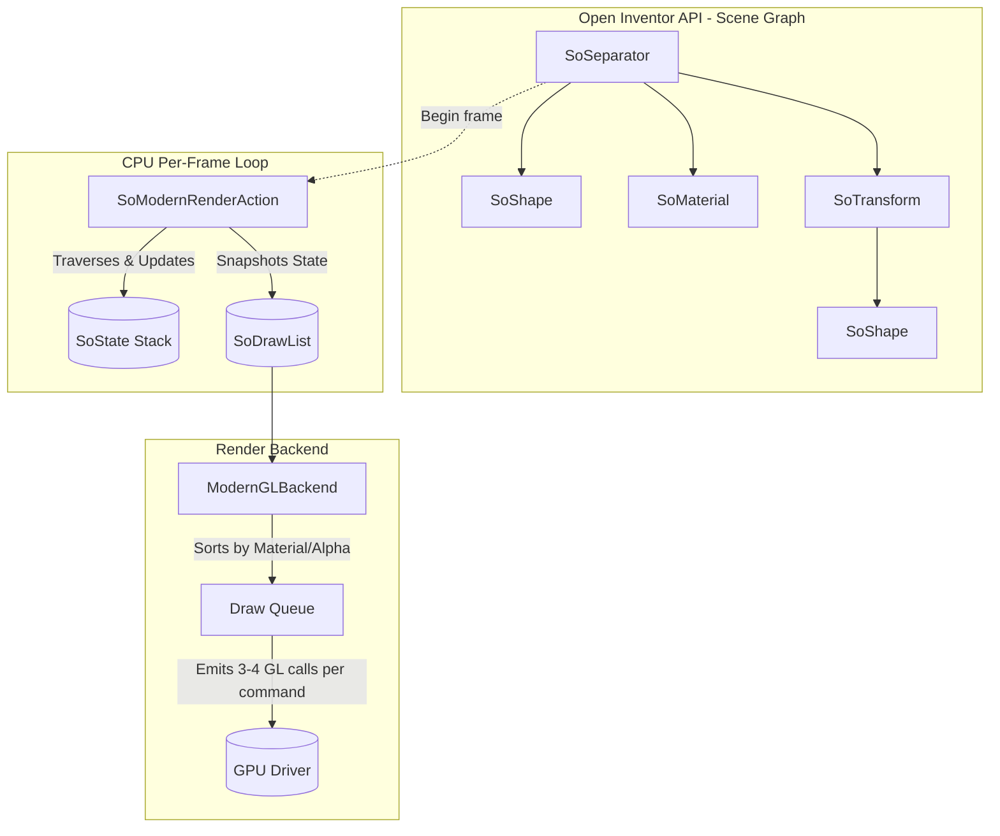
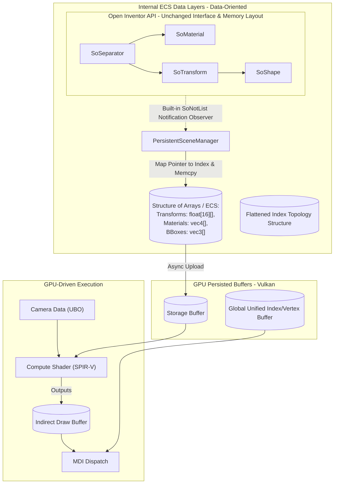

# Coin3D Modernization Plan: Data Structures and Algorithms for Real-Time Rendering

This document details an implementation plan to integrate the last 30 years of rendering advancements into Coin3D's modern renderer while strictly preserving the existing Open Inventor API compatibility.

## 1. Architectural Investigation: Current State

Coin3D implements the Open Inventor (OIV) standard, utilizing an object-oriented hierarchical scene graph. 

### Data Structures & Algorithms
- **Data Structure - `SoNode` Hierarchy:** The scene is structured as a tree/DAG of `SoNode` subclasses (`SoSeparator`, `SoTransform`, `SoMaterial`, `SoShape`). 
- **Algorithm - Recursive Traversal:** Behaviors are executed via `SoAction` subclasses (e.g., `SoGLRenderAction`, `SoHandleEventAction`). The action starts at the root node and recursively traverses children.
- **Data Structure - `SoState` & Elements:** A stack-based state machine (`SoState`) accumulates information as the tree is walked down, tracking changes in transforms, materials, and other OpenGL-like properties via push/pop operations using `SoElement` subtypes.
- **Algorithm - The Modern Renderer Branch:** To pull away from direct fixed-function legacy GL, the `unified-renderer` branch introduces `SoModernRenderAction`, which walks the tree per frame and extracts state down into an Intermediate Representation (IR).
- **Data Structure - The IR (`SoDrawList` & `SoRenderCommand`):** During traversal, elements affecting a shape are snapshotted into `SoRenderCommand` (which holds `GeometryDesc`, `MaterialData`, and `RenderState`), and appended to a flat `SoDrawList`. This struct list is consumed by `ModernGLBackend` to emit VAO/VBO bindings and indexed draw lists.

### Existing Architecture Diagram


### Limitations of the Current Approach
Although the `modern-renderer` branch introduces a clean IR, it still inherits the standard Open Inventor bottleneck: **per-frame recursive tree traversal**. Navigating a deep pointer-chasing hierarchy, managing state stacks, and generating the draw list sequentially limits the CPU performance dramatically compared to modern engines. Culling occurs on the CPU during traversal, using hierarchical bounding box checks, causing high latency.

---

## 2. Incorporating the Last 30 Years of Advancements

Modern Data-Oriented Design (DOD) and "GPU-Driven Pipeline" paradigms mandate shifting from pointer-chasing CPU traversal into flat, GPU-friendly contiguous arrays. A fundamental tension exists between the Object-Oriented legacy of Open Inventor (where users dynamically allocate `SoGroup`, `SoTransform` objects with embedded fields) and the Cache-Aligned data layout of modern engines (Entity-Component Systems).

**The Challenge with the Open Inventor API**: The prompt dictates that the API must remain compatible. To achieve the massive performance gains of DOD while keeping the API unchanged, we will exploit Coin3D's macro reflection system to build a **Shadow ECS**. 

### Advancements to Employ:
1. **The "Shadow ECS" Manager (Zero Node Rewrites)**
   - Instead of hollowing out or proxying every specific `SoNode` subclass, we leave the legacy node classes totally untouched (preserving 100% ABI and binary compatibility).
   - Coin3D guarantees that every field mutation fires `SoField::valueChanged()` and `SoNode::startNotify()`. We will create a `PersistentSceneManager` that attaches an `SoNodeSensor` to the root scene. Whenever an application triggers an update, the manager listens to the `SoNotList` and replicates the exact updated values directly into our underlying Structure of Arrays (SoA).
   - The scene graph is traversed strictly once during initialization. Post-initialization, the tree acts purely as an authoring frontend while the rendering backend relies exclusively on the Shadow ECS.

2. **Persistent Flattened GPU Scene Manager**
   - We abandon per-frame recursive pointer-chasing completely. Relationships between nodes are mapped as index references rather than pointer hierarchies.

3. **GPU-Driven Object Buffer (Bindless Resources via Vulkan)**
   - Upload the flattened ECS array of structural render properties (transforms, material IDs, and bounding boxes) into a single large Vulkan Storage Buffer (`VK_DESCRIPTOR_TYPE_STORAGE_BUFFER`) asynchronously.
   - Material parameters and Textures are bound using Vulkan Descriptor arrays (Bindless Textures). 

4. **Compute-Based Visibility / Frustum Culling**
   - A Vulkan Compute Shader (compiled from GLSL to SPIR-V) reads the Storage Buffer Bounding Boxes, performs Frustum Culling (and potentially Hierarchical Z-Buffer Occlusion Culling), and populates an indirect command buffer natively on the GPU, completely eliminating CPU culling bottlenecks.

5. **Multi-Draw Indirect (MDI)**
   - The localized indices correspond directly to multi-draw execution properties. The Modern Renderer consumes the indirect commands using `vkCmdDrawIndexedIndirect` mapping back to an all-in-one Global Geometry Buffer caching all shape definitions.

---

## 3. Updated Architecture & Implementation Plan

### Proposed Architecture Diagram


### Phased Rollout Plan:

#### Phase 1: `PersistentSceneManager` Integration
- **Goal:** Build the Shadow ECS mapping layer.
- Ensure the `PersistentSceneManager` listens to changes actively via `SoNodeSensor` and `SoDataSensor` using `SoNotList` inspection.
- Build the Array allocators mapped to node hash pointers. Zero edits are needed inside `SoTransform.cpp` or sibling node implementation source files.

#### Phase 2: Compute Culling & GPU Storage Integration 
- **Goal:** Bind the CPU ECS arena to the GPU via Vulkan.
- Define Vulkan Storage Buffer layouts mapping directly to the CPU ECS arrays (utilizing MoltenVK for macOS compatibility).
- Dispatch a Vulkan compute shader mapping Frustum Culling against the Buffer Bounding Boxes to pack an output `Indirect Buffer`.

#### Phase 3: Bindless Multi-Draw Execution
- **Goal:** Reduce driver call overhead.
- Aggregate all mesh descriptions into a unified Vertex and Index buffer mapped via Vulkan.
- Substitute the localized geometry renderer with a single `vkCmdDrawIndexedIndirect` MDI execution.

#### Phase 4: Interactive GUI Testing Setup
- **Goal:** Visually validate the GPU-driven Render Pipeline using an on-screen Swapchain.
- Create an OS-level window context leveraging a library like GLFW (or raw Cocoa via Metal Surface).
- Initialize the Vulkan `VkSurfaceKHR` using macOS-specific extensions (`VK_EXT_metal_surface`).
- Develop the `VkSwapchainKHR` logic handling image acquisition, presentation modes, and resizing.
- Bind the Phase 3 `VkRenderPass` dynamically to the respective framebuffers obtained from active Swapchain Images.
- Establish robust Vulkan Synchronization (`VkSemaphore` and `VkFence`) to safely orchestrate CPU/GPU frame pacing.
- Add an interactive flying camera interface mapping inputs to the compute shader `std140` Frustum arrays to actively observe frustum culling dynamically on-screen!

#### Phase 5: Benchmark Evaluation (Legacy vs Modern)
- **Goal:** Quantify the computational and throughput advantages of the modernized ECS pipeline against legacy Object-Oriented tree traversal.
- Build a dual-metric headless runner executing exactly identical graph depths.
- Track memory upload boundaries vs native `SoGLRenderAction` caching.
- Analyze structural traversal overhead against contiguous uniform array passes mapping CPU dispatch deltas directly alongside native GPU latency.

#### Phase 6: Material and Lighting ECS Integration
- **Goal:** Translate Coin3D's traditional state-based traversal Material model into parallelized structural arrays mapped via bindless SSBO descriptor layouts.
- Convert `SoMaterial` pointer states into explicit array indices assigned natively onto shapes during initialization graph translation.
- Build parallel GPU Uniform or Storage buffers containing ambient, diffuse, specular, emmission, and shininess profiles matching `SoMaterial` output layouts.
- Construct independent Lighting buffers caching `SoDirectionalLight` parameters parsing localized ambient/diffuse contributions efficiently against generated fragment normals inside modern shader passes.

#### Phase 7: CMake Integration & Code Verification
- **Goal:** Formalize the new pipeline executables by integrating them directly into the CMake build tree, allowing standard CI/CD and developer workflows to invoke the functional validations dynamically using conventional testing patterns.
- Implement conditional inclusion of testing targets mapping GLFW and Vulkan components seamlessly inside `test-code/CMakeLists.txt`.

#### Phase 8: Vulkan Validation Layers
- **Goal:** Prevent silent crashes, undefined graphical behavior, and enforce standardized Vulkan synchronization across platforms.
- Inject `VK_LAYER_KHRONOS_validation` safely alongside a managed `VkDebugUtilsMessengerEXT` parsing debug outputs to standardized standard error queues.
- Ensure the layers are bypassed explicitly inside Production configurations (`#ifdef NDEBUG`) protecting performance regressions.

## Build and Test Instructions

To validate the modern GPU-driven pipeline and execute the dynamic UI test locally, follow these steps natively from the macOS terminal:

1. **Configure the Project**
   Ensure you have Vulkan (via VulkanSDK with MoltenVK) and GLFW available on your system, then trigger CMake to output the `test-code` targets:
   ```bash
   mkdir build && cd build
   cmake .. -DCOIN_BUILD_TESTS=ON -DCOIN_BUILD_GLX=OFF
   ```
   
2. **Build the Solution**
   Compile the library and the new executables:
   ```bash
   cmake --build . -j$(sysctl -n hw.ncpu)
   ```

3. **Run the ECS Benchmark**
   Execute the headless verification test comparing `SoGLRenderAction` vs `vkCmdDrawIndexedIndirect` speeds:
   ```bash
   ./bin/benchmark-ecs-test
   ```
   
4. **Run the GPU-Driven GUI Verification**
   Launch the interactive window environment validating the `SoMaterial` binding ECS updates. *Ensure your current working directory exposes `src/rendering/shaders/` to securely locate compile `.spv` formats.*
   ```bash
   cd ..
   ./build/bin/vulkan-gui-test
   ```

## User Review Required

> [!IMPORTANT]
> - **Shadow ECS Implementation Strategy:** Realigning away from "Proxy Nodes" and adopting a "Shadow ECS Memory" layout solves our binary compatibility limits. Modifying Coin3D to embrace Data-Oriented caching is a foundational upgrade. 
> - **Hardware Baseline Transitioned to Vulkan:** We are assuming the hardware backend target will migrate from OpenGL 4.3 to **Vulkan 1.1+** (using MoltenVK on macOS). This provides full native Compute Shader support unconstrained by Apple's OpenGL 4.1 deprecation cap.
