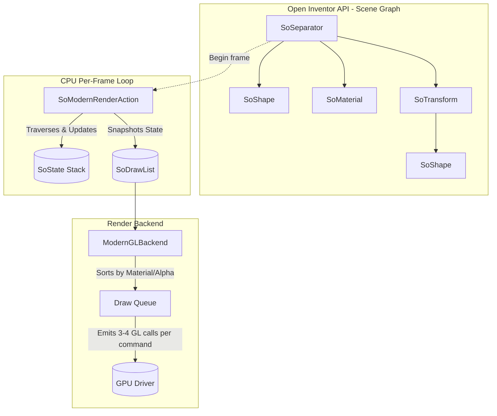

# Coin3D Modernization Plan: Data Structures and Algorithms for Real-Time Rendering

This document details an implementation plan to integrate the last 30 years of rendering advancements into Coin3D's modern renderer while strictly preserving the existing Open Inventor API compatibility.

## 1. Architectural Investigation: Current State

Coin3D implements the Open Inventor (OIV) standard, utilizing an object-oriented hierarchical scene graph. 

### Data Structures & Algorithms
- **Data Structure - `SoNode` Hierarchy:** The scene is structured as a tree/DAG of `SoNode` subclasses (`SoSeparator`, `SoTransform`, `SoMaterial`, `SoShape`). 
- **Algorithm - Recursive Traversal:** Behaviors are executed via `SoAction` subclasses (e.g., `SoGLRenderAction`, `SoHandleEventAction`). The action starts at the root node and recursively traverses children.
- **Data Structure - `SoState` & Elements:** A stack-based state machine (`SoState`) accumulates information as the tree is walked down, tracking changes in transforms, materials, and other OpenGL-like properties via push/pop operations using `SoElement` subtypes.
- **Algorithm - The Modern Renderer Branch:** To pull away from direct fixed-function legacy GL, the `unified-renderer` branch introduces `SoModernRenderAction`, which walks the tree per frame and extracts state down into an Intermediate Representation (IR).
- **Data Structure - The IR (`SoDrawList` & `SoRenderCommand`):** During traversal, elements affecting a shape are snapshotted into `SoRenderCommand` (which holds `GeometryDesc`, `MaterialData`, and `RenderState`), and appended to a flat `SoDrawList`. This struct list is consumed by `ModernGLBackend` to emit VAO/VBO bindings and indexed draw lists.

### Existing Architecture Diagram


### Limitations of the Current Approach
Although the `modern-renderer` branch introduces a clean IR, it still inherits the standard Open Inventor bottleneck: **per-frame recursive tree traversal**. Navigating a deep pointer-chasing hierarchy, managing state stacks, and generating the draw list sequentially limits the CPU performance dramatically compared to modern engines. Culling occurs on the CPU during traversal, using hierarchical bounding box checks, causing high latency.

---

## 2. Incorporating the Last 30 Years of Advancements

Modern Data-Oriented Design (DOD) and "GPU-Driven Pipeline" paradigms mandate shifting from pointer-chasing CPU traversal into flat, GPU-friendly contiguous arrays. A fundamental tension exists between the Object-Oriented legacy of Open Inventor (where users dynamically allocate `SoGroup`, `SoTransform` objects with embedded fields) and the Cache-Aligned data layout of modern engines (Entity-Component Systems).

**The Challenge with the Open Inventor API**: The prompt dictates that the API must remain compatible. To achieve the massive performance gains of DOD while keeping the API unchanged, we will exploit Coin3D's macro reflection system to build a **Shadow ECS**. 

### Advancements to Employ:
1. **The "Shadow ECS" Manager (Zero Node Rewrites)**
   - Instead of hollowing out or proxying every specific `SoNode` subclass, we leave the legacy node classes totally untouched (preserving 100% ABI and binary compatibility).
   - Coin3D guarantees that every field mutation fires `SoField::valueChanged()` and `SoNode::startNotify()`. We will create a `PersistentSceneManager` that attaches an `SoNodeSensor` to the root scene. Whenever an application triggers an update, the manager listens to the `SoNotList` and replicates the exact updated values directly into our underlying Structure of Arrays (SoA).
   - The scene graph is traversed strictly once during initialization. Post-initialization, the tree acts purely as an authoring frontend while the rendering backend relies exclusively on the Shadow ECS.

2. **Persistent Flattened GPU Scene Manager**
   - We abandon per-frame recursive pointer-chasing completely. Relationships between nodes are mapped as index references rather than pointer hierarchies.

3. **GPU-Driven Object Buffer (Bindless Resources via Vulkan)**
   - Upload the flattened ECS array of structural render properties (transforms, material IDs, and bounding boxes) into a single large Vulkan Storage Buffer (`VK_DESCRIPTOR_TYPE_STORAGE_BUFFER`) asynchronously.
   - Material parameters and Textures are bound using Vulkan Descriptor arrays (Bindless Textures). 

4. **Compute-Based Visibility / Frustum Culling**
   - A Vulkan Compute Shader (compiled from GLSL to SPIR-V) reads the Storage Buffer Bounding Boxes, performs Frustum Culling (and potentially Hierarchical Z-Buffer Occlusion Culling), and populates an indirect command buffer natively on the GPU, completely eliminating CPU culling bottlenecks.

5. **Multi-Draw Indirect (MDI)**
   - The localized indices correspond directly to multi-draw execution properties. The Modern Renderer consumes the indirect commands using `vkCmdDrawIndexedIndirect` mapping back to an all-in-one Global Geometry Buffer caching all shape definitions.

---

## 3. Updated Architecture & Implementation Plan

### Proposed Architecture Diagram
```mermaid
flowchart TD
    subgraph API [Open Inventor API - Unchanged Interface & Memory Layout]
        root["SoSeparator"] --> mat["SoMaterial"]
        root --> trans["SoTransform"]
        trans --> shape1["SoShape"]
    end

    subgraph InternalState [Internal ECS Data Layers - Data-Oriented]
        API -. "Built-in SoNotList Notification Observer" .-> SceneManager["PersistentSceneManager"]
        SceneManager -- "Map Pointer to Index & Memcpy" --> SOA
        SOA[("Structure of Arrays / ECS:\nTransforms: float[16][],\nMaterials: vec4[],\nBBoxes: vec3[]")]
        Tree[("Flattened Index Topology Structure")]
    end

    subgraph GPUStorage [GPU Persisted Buffers (Vulkan)]
        SOA -- Async Upload --> SSBO[("Storage Buffer")]
        GeoCache[("Global Unified Index/Vertex Buffer")]
    end

    subgraph GPUPipeline [GPU-Driven Execution]
        cam["Camera Data (UBO)"] --> Compute["Compute Shader (SPIR-V)"]
        SSBO --> Compute
        Compute -- Outputs --> MDI[("Indirect Draw Buffer")]
        
        MDI --> Draw["MDI Dispatch"]
        GeoCache --> Draw
    end
```

### Phased Rollout Plan:

#### Phase 1: `PersistentSceneManager` Integration
- **Goal:** Build the Shadow ECS mapping layer.
- Ensure the `PersistentSceneManager` listens to changes actively via `SoNodeSensor` and `SoDataSensor` using `SoNotList` inspection.
- Build the Array allocators mapped to node hash pointers. Zero edits are needed inside `SoTransform.cpp` or sibling node implementation source files.

#### Phase 2: Compute Culling & GPU Storage Integration 
- **Goal:** Bind the CPU ECS arena to the GPU via Vulkan.
- Define Vulkan Storage Buffer layouts mapping directly to the CPU ECS arrays (utilizing MoltenVK for macOS compatibility).
- Dispatch a Vulkan compute shader mapping Frustum Culling against the Buffer Bounding Boxes to pack an output `Indirect Buffer`.

#### Phase 3: Bindless Multi-Draw Execution
- **Goal:** Reduce driver call overhead.
- Aggregate all mesh descriptions into a unified Vertex and Index buffer mapped via Vulkan.
- Substitute the localized geometry renderer with a single `vkCmdDrawIndexedIndirect` MDI execution.

## User Review Required

> [!IMPORTANT]
> - **Shadow ECS Implementation Strategy:** Realigning away from "Proxy Nodes" and adopting a "Shadow ECS Memory" layout solves our binary compatibility limits. Modifying Coin3D to embrace Data-Oriented caching is a foundational upgrade. 
> - **Hardware Baseline Transitioned to Vulkan:** We are assuming the hardware backend target will migrate from OpenGL 4.3 to **Vulkan 1.1+** (using MoltenVK on macOS). This provides full native Compute Shader support unconstrained by Apple's OpenGL 4.1 deprecation cap.
